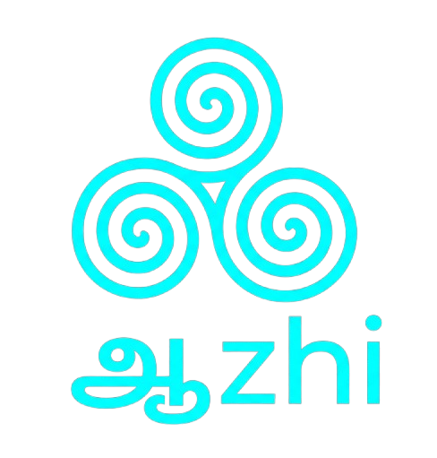
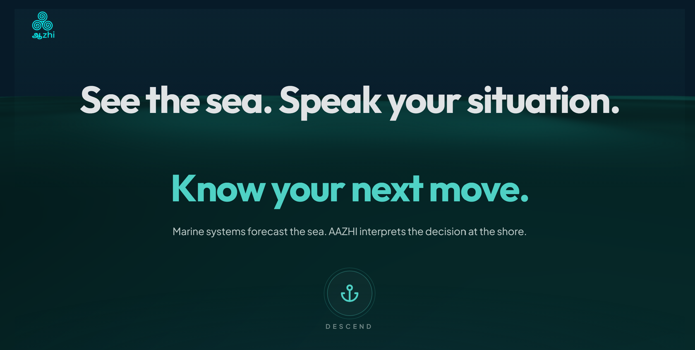
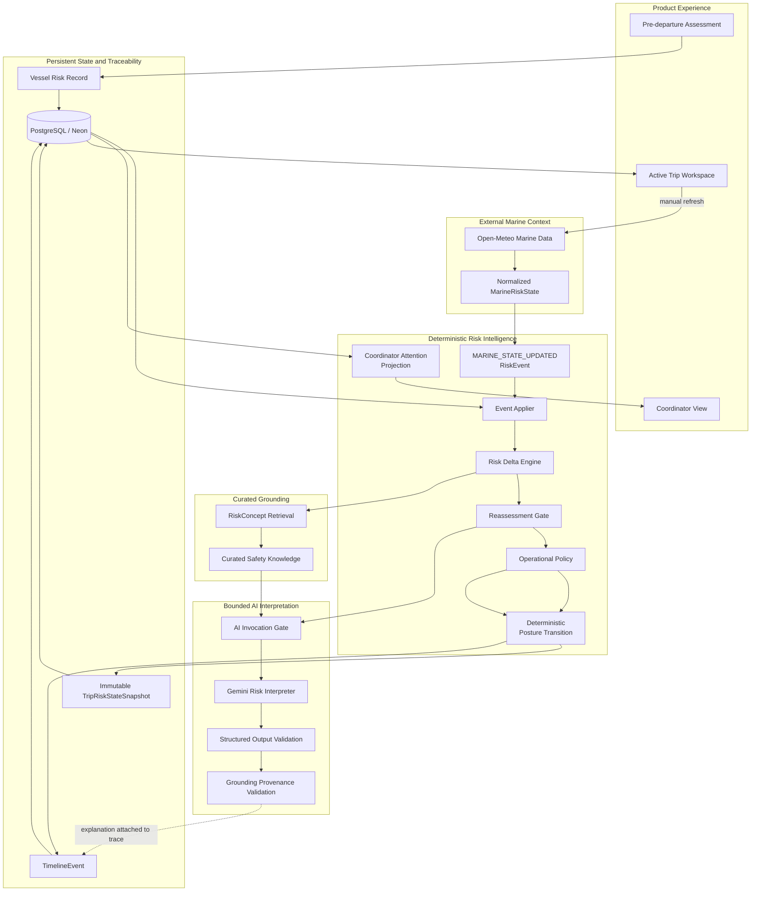
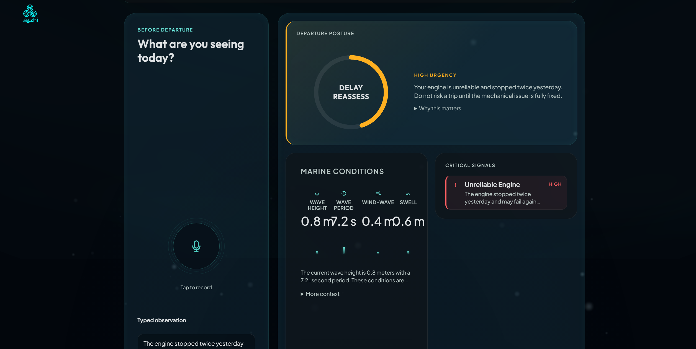
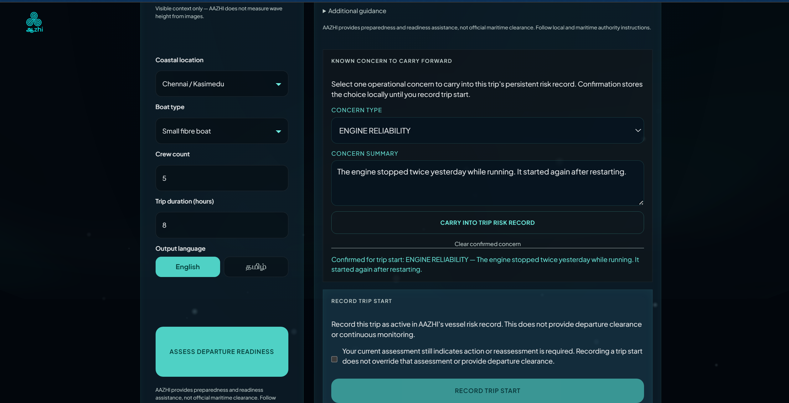
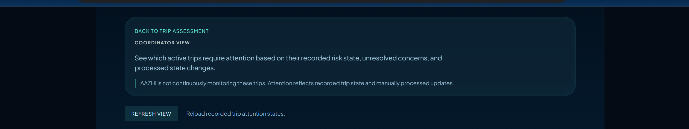

<p align="center">
  
</p>

<h1 align="center">AAZHI</h1>

<p align="center">
  <strong>Operational Risk-State Intelligence for Small Fishing Operations</strong>
</p>

<p align="center">
  <strong>TOP 10 · PROMPT WARS BENGALURU 2026 · SOLO IN-PERSON BUILD</strong>
</p>

<p align="center">
  <a href="https://aazhi-final.vercel.app/">Live synthetic demo</a></br></br>
  <a href="https://github.com/RPK2103/aazhi/actions/workflows/release-gate.yml"></a>
</p>

> **Forecasts describe the environment. AAZHI maintains the operational risk state of a trip and explains when that state materially changes.**
<p align="center">
  <a href="https://aazhi-final.vercel.app/">
    
  </a>
</p>

<p align="center">
  <em>
    From contextual assessment to persistent trip risk state and coordinator attention.
  </em>
</p>
---

## Product visual

<p align="center">
  
</p>

---

## The operational gap

A marine forecast can report wave height, wave period, wind, and changing sea conditions.

It does not inherently retain that an engine stopped twice yesterday, communication equipment remains unreliable, or a vessel concern has only been reported as handled but not confirmed resolved.

AAZHI connects environmental change with the operational context that remains active for a specific trip.

> **What changed, and why does it matter given what is still unresolved about this trip?**

AAZHI is not an AI weather application, chatbot, multi-agent platform, LLM wrapper, vessel-tracking system, autonomous navigation tool, maritime-clearance system, or safety-certification product.

---

## What AAZHI holds

| Capability | What the product does |
| --- | --- |
| **Contextual pre-departure assessment** | Typed observations, voice input, image context, crew and trip details, marine reference location, and contextual Gemini assessment via `POST /api/assess` |
| **Explicit concern confirmation** | Human-confirmed concern carry-forward with bounded `RiskConcept` vocabulary; model blockers are not auto-persisted — concerns enter the risk record only when the trip is recorded |
| **Persistent active-trip risk state** | Vessel and trip risk record, versioned immutable snapshots, active concern preservation, PostgreSQL/Neon as source of truth, browser storage limited to continuity identifiers |
| **Manual marine reassessment** | User-initiated latest sea-condition check, normalized marine state, exact state deltas, reassessment sensitivity, bounded policy, updated posture and timeline |
| **Grounded interpretation** | Selective AI invocation, curated `RiskConcept` safety retrieval, structured Gemini output, source provenance validation, fail-closed interpretation boundary |
| **Coordinator attention workspace** | Active-trip attention groups, `PERSISTED_STATE` and `PROCESSING_TRACE` attention bases, deterministic ordering — no AI ranking, no marine-provider call during projection |

---

## How AAZHI thinks

> **Deterministic systems detect.**
> **Curated retrieval grounds.**
> **AI interprets.**
> **Deterministic policy controls operational action.**
> **Persistence preserves risk memory.**

AAZHI uses AI only where contextual language interpretation adds value. State comparison, reassessment, operational policy, posture transitions, persistence, and coordinator ordering remain explicit and system-controlled.

**Gemini explains validated interactions. Deterministic systems control operational consequences.**

---

## Product lifecycle

Manual marine checks and human-confirmed concerns — not continuous monitoring, GPS, or AIS tracking.

```mermaid
flowchart LR
    subgraph Operator["Trip operator"]
        A["Observation, voice, image<br/>and trip context"]
        B["Gemini multimodal<br/>pre-departure assessment"]
        C["Explicit human<br/>concern confirmation"]
        D["Record trip start"]
    end

    subgraph ActiveTrip["Persistent active trip"]
        E["Vessel risk record"]
        F["Versioned RiskState"]
        G["Active Trip Workspace"]
        H["Manual: Check latest<br/>sea conditions"]
        I["Contextual risk processing"]
        J["Updated state<br/>and timeline"]
    end

    subgraph Coordination["Shore coordination"]
        K["Persisted active trips"]
        L["Deterministic attention<br/>projection"]
        M["Coordinator View"]
    end

    A --> B --> C --> D
    D --> E --> F --> G
    G --> H --> I --> J
    J --> F
    F --> K
    J --> K
    K --> L --> M
```



| Note | Detail |
| --- | --- |
| Concern persistence | Requires explicit human confirmation before trip recording |
| Marine refresh | User-initiated manual check — not background polling |
| Marine reference location | Configured coastal reference point — not live vessel tracking |
| Coordinator View | Read-only projection over persisted state and timeline traces |

---

## Intelligence architecture



| Responsibility | System owner |
| --- | --- |
| Normalize marine context | Marine adapter |
| Detect factual state change | Risk Delta Engine |
| Determine reassessment | Reassessment Gate |
| Derive bounded action | Operational Policy |
| Retrieve safety context | `RiskConcept` retrieval |
| Explain validated interaction | Gemini Risk Interpreter |
| Validate model structure | Zod / runtime schemas |
| Validate grounding sources | Provenance validator |
| Transition operational posture | Deterministic posture logic |
| Preserve historical state | PostgreSQL / Neon snapshots |
| Prioritise coordinator attention | Deterministic read projection |

---

## Golden scenario — unresolved engine concern meets changing sea conditions

Synthetic workflow-conformance scenario — not field validation or maritime safety accuracy.

### Unresolved trip context

```text
ENGINE_RELIABILITY
OPEN
```

> “The engine stopped twice yesterday while running and restarted after intervention.”

### Environmental change

| Measurement | Recorded state | Updated state | Delta |
| --- | ---: | ---: | ---: |
| Wave height | 0.8 m | 1.5 m | **+0.7 m** |
| Wind speed | 13 km/h | 18 km/h | +5 km/h |

### System result

```text
MATERIAL_ENVIRONMENTAL_CHANGE_WITH_ACTIVE_CONCERN
        ↓
COORDINATOR_REVIEW_REQUIRED
        ↓
Selective grounded Gemini interpretation
        ↓
RiskState v1 → RiskState v2
        ↓
ATTENTION_REQUIRED
PROCESSING_TRACE basis
```

The `0.5 m` wave value is an internal reassessment-sensitivity threshold in the current prototype. It is not represented as a universal maritime danger threshold. Wind change in this scenario is detected but below the `10 km/h` sensitivity threshold and does not trigger reassessment on its own.

Harness: `src/evals/scenarios/S003-engine-wave-deterioration.ts`

---

## AI authority boundary

> **Gemini sits at the interpretation boundary, not the decision boundary.**

| Deterministic system | Gemini | Explicitly unsupported |
| --- | --- | --- |
| Calculates `RiskDelta` | Explains validated interactions | Declaring a vessel safe |
| Decides reassessment | Communicates significance | Selecting operational action |
| Derives `OperationalAction` | Communicates uncertainty | Generating a risk score |
| Transitions `RiskPosture` | References supplied grounding | Overriding policy |
| Persists state versions | Produces structured explanation | Resolving concerns |
| Orders coordinator attention | — | Ranking trips |
| Enforces idempotency | — | Arbitrary state mutation |

---

## Selective and grounded AI

```text
Calculated deltas
+ active concerns
+ reassessment result
+ curated safety context
        ↓
AI Invocation Gate
        ↓
Gemini Risk Interpreter
        ↓
Structured Output Validation
        ↓
Grounding Provenance Validation
```

Interpretation may be **`SKIPPED`**, **`SUCCEEDED`**, or **`FAILED`**. Gemini is not called when `reassessmentDecision.required` is false. Malformed output is rejected. Fabricated grounding metadata rejects the complete interpretation. Deterministic policy and state processing continue on interpreter failure — no fallback AI explanation is invented.

> **A citation is part of the output contract, not decoration.**

Retrieval is curated, deterministic, and `RiskConcept`-based. It is not embedding-based, vector-database-backed, or runtime web search.

---

## Persistent operational memory

| Entity | Role |
| --- | --- |
| `Vessel` | Registered vessel identity and type |
| `VesselConcern` | Bounded concern records with lifecycle status |
| `Trip` | Active trip context, marine reference location, timing |
| `TripRiskStateSnapshot` | Immutable versioned operational risk state |
| `TimelineEvent` | Append-only processing and activity trace |

```text
RiskState v1
ENGINE_RELIABILITY = OPEN

RiskState v2
ENGINE_RELIABILITY = RESOLVED

Historical v1 remains OPEN.
```

Snapshots are immutable and versioned per trip. Historical snapshots do not re-query the latest concern record. PostgreSQL on Neon is the source of truth. Browser `localStorage` holds continuity identifiers only (`aazhi:vessel-id`, `aazhi:active-trip-id`). Marine state, risk state, concern history, and interpretation history are not browser-owned.

---

## Event processing and traceability

```text
MARINE_STATE_UPDATED
→ load persisted state
→ apply factual event
→ calculate deltas
→ evaluate reassessment
→ derive policy
→ selectively interpret
→ transition posture
→ persist factual state change
→ append timeline trace
```

Stable event IDs support idempotency. Duplicate events do not invoke Gemini again, create another snapshot, or append another processing trace. Snapshots are created only when factual state changes (`deltas.length > 0`). A no-change manual check does not produce a fake state version.

---

## Coordinator attention

The Coordinator View is a shore-side read projection over persisted active trips.

| Attention group | Driven by `RiskPosture` |
| --- | --- |
| `ATTENTION_REQUIRED` | `REASSESSMENT_REQUIRED`, `COORDINATOR_REVIEW_REQUIRED`, `OFFICIAL_ALERT_PRIORITY` |
| `WATCH` | `CAUTION` |
| `STABLE` | `BASELINE` |

| Field | Value |
| --- | --- |
| Current posture | `REASSESSMENT_REQUIRED` |
| Latest manual check | `NO_MATERIAL_CHANGE` |
| Latest policy action | `NO_ACTION_REQUIRED` |
| Attention basis | `PERSISTED_STATE` |

> **No new action is not the same as no existing concern.**

The latest event is not automatically the reason for attention. Attention may derive from a relevant processing trace or from persisted posture when no later material trace exists. The projection does not invent a missing explanation. Classification and sorting are deterministic. Gemini does not rank trips. The Coordinator View does not fetch marine context and does not mutate state.

---

## Product surfaces

### Contextual assessment

<p align="center">
  
</p>

Observation, voice and image input, coastal marine reference location, trip context, and pre-departure contextual assessment — the intake path into concern confirmation and trip recording.

### Active trip workspace

<p align="center">
  
</p>

Current posture, active concerns, state version, recorded risk state, latest manual check, material deltas, bounded policy action, grounded interpretation when invoked, and manual marine-update workflow.

### Coordinator attention

<p align="center">
  
</p>

Attention groups, attention basis, active concerns, and deterministic trip ordering — read projection without AI ranking or marine-provider calls.

---

## Engineering quality

| Engineering signal | Verified result |
| --- | ---: |
| Vitest tests | **532 passed** |
| Vitest test files | **45 passed** |
| Playwright product-contract executions | **36 passed** |
| Line coverage | **91.38%** |
| Statement coverage | **91.36%** |
| Function coverage | **92.75%** |
| Branch coverage | **78.49%** |
| High/critical production dependency findings | **0** |
| Moderate production dependency findings | **5** |

Prisma generation and validation · application and E2E typechecking · lint verification · production build · clean-install verification · GitHub Actions Release Gate · desktop and mobile product-contract coverage · reduced-motion and fallback paths · security-header checks · keyboard-flow checks

No high or critical production dependency vulnerabilities were reported during the final release audit. Five moderate transitive or tooling-related findings remain.

> Automated evaluation measures conformance to the implemented deterministic, persistence, UI-contract, and AI-boundary workflows. It does not measure real-world maritime safety outcomes.

---

## Technology architecture

| Layer | Stack |
| --- | --- |
| **Product experience** | Next.js 16 App Router, React, TypeScript, Motion, React Three Fiber, Three.js, custom marine design system |
| **AI and interpretation** | Gemini (`gemini-3.1-flash-lite`), Google GenAI, Zod structured validation, curated `RiskConcept` retrieval, grounding provenance validation |
| **Risk intelligence** | Bounded domain vocabulary, Risk Delta Engine, reassessment gate, deterministic operational policy, event-processing orchestrator, coordinator attention projection |
| **State and infrastructure** | PostgreSQL, Neon, Prisma 7.8.0, Vercel |
| **Quality and release** | Vitest, Playwright, GitHub Actions, Node 22.x |

---

## AI accelerated the build. Deterministic boundaries control the product.

**Gemini** is a runtime product component for multimodal pre-departure interpretation, constrained contextual risk explanation, and structured grounded output.

**Antigravity** supported the engineering workflow through repository exploration, multi-file implementation, architecture iteration, debugging, rapid validation cycles, and hackathon execution.

AI-assisted development accelerated execution, but architectural authority remained explicit. Inside AAZHI, AI is deliberately prevented from owning policy, state transitions, risk scoring, or coordinator ranking.

---

## Responsible product boundary

| AAZHI currently provides | AAZHI does not claim |
| --- | --- |
| Synthetic operational-risk workflows | Maritime clearance |
| Manual marine-context reassessment | Continuous monitoring |
| Persistent trip risk state | GPS or AIS tracking |
| Bounded operational policy | Seaworthiness certification |
| Grounded contextual explanation | Accident prediction |
| Coordinator attention projection | Field-validated safety outcomes |

AAZHI is currently suitable for synthetic public demonstration and engineering evaluation. Real operational deployment would require authentication, tenancy, ownership enforcement, abuse protection, field validation, and controlled integration with maritime stakeholders.

---

## What needs to be validated with operators

- Fisher and boat-operator workflow interviews
- Cooperative/coordinator workflow fit
- Concern vocabulary and status-transition fit
- Reassessment sensitivity calibration
- Marine data-provider suitability
- Low-connectivity and local-language usability
- Authentication, ownership, and tenancy requirements
- Controlled pilot design

---

## Closing

AAZHI demonstrates an Applied AI architecture in which language intelligence is useful but bounded: deterministic systems retain authority over operational state, action, and attention, while Gemini explains validated context.

**Top 10 · Prompt Wars Bengaluru 2026 · Solo in-person build**

**Kaviyashre Ragupathy**

[Live synthetic demo](https://aazhi-final.vercel.app/) · [Coordinator view](https://aazhi-final.vercel.app/coordinator) · [GitHub repository](https://github.com/RPK2103/aazhi)

Marine forecast values are retrieved from the [Open-Meteo Marine Weather API](https://open-meteo.com/en/docs/marine-weather-api).

---

<details>
<summary>Complete risk-domain vocabulary</summary>

**RiskConcept:** `ENGINE_RELIABILITY`, `HULL_INTEGRITY`, `VESSEL_STABILITY`, `PRIMARY_COMMUNICATION`, `COMMUNICATION_REDUNDANCY`, `SAFETY_EQUIPMENT`, `WAVE_CONDITIONS`, `WIND_CONDITIONS`, `OFFICIAL_ALERT`, `TRIP_DURATION`, `CHECK_IN_STATUS`

**RiskPosture:** `BASELINE`, `CAUTION`, `REASSESSMENT_REQUIRED`, `COORDINATOR_REVIEW_REQUIRED`, `OFFICIAL_ALERT_PRIORITY`

**OperationalAction:** `NO_ACTION_REQUIRED`, `REASSESSMENT_REQUIRED`, `COORDINATOR_REVIEW_REQUIRED`, `OFFICIAL_ALERT_PRIORITY`

**ConcernStatus:** `OPEN`, `RESOLUTION_REPORTED`, `RESOLVED`, `DISMISSED`

**ReassessmentReason:** `NO_MATERIAL_CHANGE`, `MATERIAL_ENVIRONMENTAL_CHANGE`, `MATERIAL_ENVIRONMENTAL_CHANGE_WITH_ACTIVE_CONCERN`, `CONCERN_STATE_CHANGED`, `OFFICIAL_ALERT_CHANGED`

**InterpretationStatus:** `SKIPPED`, `SUCCEEDED`, `FAILED`

</details>

<details>
<summary>API and persistence model reference</summary>

| Method | Route |
| --- | --- |
| `POST` | `/api/assess` |
| `POST` | `/api/risk/trips/start` |
| `GET` | `/api/risk/trips/[tripId]` |
| `POST` | `/api/risk/trips/[tripId]/refresh-marine` |
| `GET` | `/api/risk/coordinator/attention` |

Schema: `prisma/schema.prisma` · Persistence notes: `docs/persistence/README.md`

</details>

<details>
<summary>Interpretation failure states and idempotency details</summary>

**Failure stages:** `INTERPRETER_PROVIDER`, `INTERPRETER_PARSE`, `INTERPRETER_ZOD_VALIDATION`, `INTERPRETER_GROUNDING_VALIDATION`, `UNKNOWN`

**Failure reasons:** `PROVIDER_FAILURE`, `INVALID_INTERPRETATION_OUTPUT`, `GROUNDING_PROVENANCE_FAILURE`, `UNKNOWN_INTERPRETER_FAILURE`

**Idempotency:** Duplicate `MARINE_STATE_UPDATED` events match prior `RISK_EVENT_PROCESSED` timeline entries by `sourceEventId` and return the reconstructed result without reprocessing.

**Grounding validation:** Each `groundingSources` entry must match retrieved record `recordId`, `authority`, `documentTitle`, `sourceLocator`, and `sourceUrl`.

</details>

<details>
<summary>Release and evaluation scope</summary>

CI workflow `.github/workflows/release-gate.yml` runs `verify:release` and `audit:prod` on `main` and pull requests.

Deterministic scenario harness: S001–S015 in `src/evals/scenarios/`. Golden scenario documentation: `docs/evaluations/S003-unresolved-engine-worsening-marine-conditions.md`.

Playwright product-contract tests intercept API responses — they do not prove browser-to-live-Neon, Gemini, or Open-Meteo integration.

</details>
